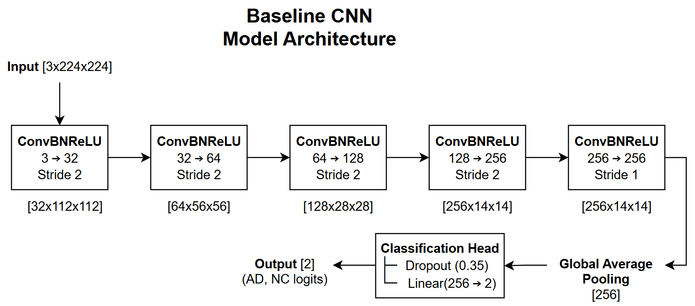
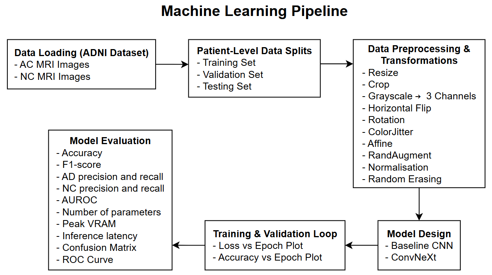
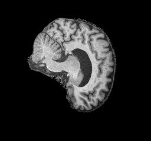
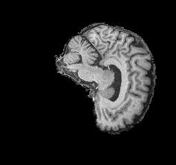

# Neuroimaging (ADNI Brain MRI) Using ConvNeXt
**Author:** Lawrence Tiang  
**Student ID** s4892210  
**Course:** COMP3710 – Pattern Analysis (2026)  
**Implementation Difficulty:** Hard


## 1. Project Overview
### 1.1 Problem & Motivation
As of 2026, approximately 40 million people worldwide are living with Alzheimer's Disease and this number is expected to triple by 2050 [1]. The chronic brain disorder is a progressive neurodegenerative disease that can affect an individual's ability to perform everyday activities through the gradual impairment of memory and cognitive functions. It is characterised by structural changes in the brain, including hippocampal and cortical atrophy with ventrivular enlargement. This project investigates automated classification of T1-weighted structural brain MRI scans into Alzheimer's Disease (AD) and Normal Cognitive (NC) classes to support earlier screening. Early detection is important because identifying potential signs of AD can facilitate timely diagnois and early intervention. However, it is challenging to accurately discriminate AD from normal ageing due to natural variations in brain structure, head shape and patient age.

### 1.2 Proposed Algorithm
For this project I used a ConvNeXt model to help distinguish Alzheimer's Disease (AD) from Normal Cognitive (NC) subjects. ConvNeXt is a modern convolutional neural network (CNN) architecture developed by Facebook AI Research in 2022. The model combines the strengths of traditional CNN architectures with modern design improvements to achieve strong performance on image classification tasks while maintaining computational efficiency and scalability [2]. Specifically, ConvNeXt incorporates design concepts from ResNet and Vision Transformers, including depthwise convolutions, layer normalisation, GELU activation functions and residual connections. Its hierarchical architecture allows the model to progressively learn increasingly complex features from the input MRI images. This is particularly useful for this classification problem because the anatomical differences between AD and NC scans can be subtle and may require the model to capture both local and global patterns within the brain.

### 1.3 How It Works
To systematically train and evaluate the ConvNeXt model I will follow the machine learning pipeline to ensure a clear workflow. As a general overview, the pipeline begins with the ADNI dataset which contains the brain MRI images labelled as either AD or NC. I first separate the dataset into training, validation and testing sets using patient-level splitting. Then I preprocessed the images by resizing them, converting the greyscale to three channels and normalising their pixel intensities. For the training set I applied additional data augmentation, including random cropping, horizontal flipping, rotation, ColorJitter, affine transformations, RandAugment and random erasing. The processed images are passed through the ConvNeXt model training loop to produce predictions for the AD and NC classes. After each epoch, the model is evaluated on the validation set and the checkpoint with the lowest validation loss is saved as the best model. Once training is complete the best model is evaluated on the test set to assess its final classification performance.

I also compared ConvNeXt against a simpler baseline CNN to determine whether the additional complexity is benefifical. The baseline model consists of five convolutional blocks followed by global averge pooling, dropout and a linear classification layer. Both models are evaluated using accuracy, F1-score, AUROC, precision, recall and computational costs.

  

### 1.4 High-level Visualisation
  


## 2. Feasibility Review
### 2.1 User Need, Scope & Acceptance Criteria
#### Intended User
Describe the intended user of the system

#### Prototype Purpose  
The context in which the prototype would be used.

#### Acceptance Criteria
1. The ConvNeXt model achieves a minimum test accuracy of 0.80, demonstrating useful discrimination between Alzheimer’s disease (AD) and normal control (NC) cases.
2. The ConvNeXt model achieves higher or comparable classification performance to the baseline CNN on the test set.
3. The relationship between predicted confidence and diagnostic correctness is evaluated by comparing confidence distributions for correct and incorrect predictions.
4. The training and evaluation pipeline runs successfully on the Rangpur HPC cluster with peak VRAM and inference latency recorded to assess computational resource requirements.
5. The final system must produce reproducible evaluation results on the test set and complete within the available 12 hour Rangpur HPC training limit.

### 2.2 Model Choice & Course Concepts
#### Proposed Dataset Configuration
```
ADNI/AD_NC/
├── test/  
│   ├── AD/
│   │   ├── <patient_id>_<segment_id>.jpeg
│   │   └── ... 
│   └── NC/
│       ├── <patient_id>_<segment_id>.jpeg
│       └── ... 
└── train/
    ├── AD/
    │   ├── <patient_id>_<segment_id>.jpeg
    │   └── ... 
    └── NC/
        ├── <patient_id>_<segment_id>.jpeg
        └── ... 
```
- which dataset used (dataset name) and where can find
- 2d greyscale MRI brain scans divided two categories
- ``
- number of samples and classes
- training, validation and testing splits
- splitting strategy (random?)
- state if data transformation applied to training and test set

#### Model Architecture
Describe the proposed model architecture and its main components.

```
Input [1×256×256]
    ↓
┌─────────────────────────┐
│  Patchify Stem (4×4)    │  → [96×64×64]
└─────────────────────────┘
    ↓
┌─────────────────────────┐
│  Stage 1 (3 blocks)     │  → [96×64×64]
│  ├─ ConvNeXt Block      │
│  ├─ ConvNeXt Block      │
│  └─ ConvNeXt Block      │
└─────────────────────────┘
    ↓ [Downsample 2×2]
┌─────────────────────────┐
│  Stage 2 (3 blocks)     │  → [192×32×32]
└─────────────────────────┘
    ↓ [Downsample 2×2]
┌─────────────────────────┐
│  Stage 3 (27 blocks)    │  → [384×16×16]  ← Deepest stage
└─────────────────────────┘
    ↓ [Downsample 2×2]
┌─────────────────────────┐
│  Stage 4 (3 blocks)     │  → [768×8×8]
└─────────────────────────┘
    ↓ [Global Avg Pool]
┌─────────────────────────┐
│  Classification Head    │
│  ├─ LayerNorm           │
│  ├─ Dropout (0.3)       │
│  └─ Linear(768→2)       │
└─────────────────────────┘
    ↓
Output [2] (AD, NC logits)
```

#### Course Concepts & Literature
Explain how relevant course concepts and academic literature support the preprocessing methods, model architecture, and experimental approach.
- Equations
- Find sources

### 2.3 Preliminary Feasibility Evidence
#### Initial Data Audit
- Class distribution.
- dimension of images 256 by 240 pixels

| Alzheimer's Disease (AD) Example | Normal Control (NC) Example |
|---------------------|--------------------------|
|  |  |

#### Baseline Smoke Test & Resource Estimate
Describe the initial experiment used to determine whether the proposed approach is technically feasible.
- Training time.
- GPU/CPU requirements.
- Memory requirements.
- Expected inference cost or latency.

### 2.4 Risks, Budget & Fallback
#### Technical Risks
- Overfitting.
- Data leakage.
- Insufficient training data.
- Poor generalisation.
- Computational limitations.
- High inference latency.

#### Computing Budget
- GPU used (1 A100)
- CPU used (2 CPUs)
- Maximum practical training time (12 hours)

#### Next Planned Experiment
Describe the next experiment you plan to conduct and explain why it is the most useful next step.
Describe a fallback approach


## 3. Dependencies and Reproducibility
### 3.1 Software Requirements
| Package | Version |
|---|---|
| Python | check version on rangpur |

### 3.2 Reproducing Results
address reproducibility of results (random seeds)
submitting slurm script
1. Clone the repository and ensure all dependencies are installed.
2. Navigate to the recognition directory.
3. running python train.py to train model and python predict.py to perform inference on test set, python util.py

```
recognition/ConvNeXt_s4892210/
├── assets/
│   ├── ad_example.jpeg
│   ├── nc_example.jpeg
│   └── pipeline.png
├── dataset.py  
├── modules.py  
├── predict.py  
├── README.md 
├── train.py
└── util.py
```


## 4. Data Preprocessing
### 4.1 Training, Validation & Testing Splits
Describe the final dataset split in detail.

| Split | Number of Samples | Percentage |
|---|---:|---:|
| Training | [Value] | [X]% |
| Validation | [Value] | [Y]% |
| Testing | [Value] | [Z]% |

- How the split was performed.
- Whether the split was random, stratified, subject-wise, time-based, etc.
- How class proportions were maintained.
- How data leakage was prevented (patient level splits).

Where multiple samples originate from the same subject, subject-level splitting will be used to prevent information leakage between the training and testing sets.

### 4.2 Data Transformations
Describe all preprocessing performed on the data.
- data augmentation and description of what it does
- why use this data augmentation (simulate what?)

Include references where preprocessing methods are based on existing literature.


## 5. Experimental Runs
### 5.1 Failed Runs
- figures
- test accuracy
- What was attempted
- Why it failed
- What was learned
- What was changed as a result

### 5.2 Final Experimental Configuration
- explain why choose optimiser and loss function

| Parameter | Value |
|---|---|
| Batch size | [Value] |
| Learning rate | [Value] |
| Number of epochs | [Value] |
| Optimiser | [Value] |
| Loss function | [Value] |
| Learning-rate scheduler | [Value] |
| Random seed | [Value] |


## 6. ConvNeXt Final Outputs & Visualisations
### 6.1 ConvNeXt Prediction Results
- correct predictions examples

### 6.2 ConvNeXt Performance Visualisations
- Training/validation curves (loss and accuracy)
- Confusion matrix (base and convnext)
- roc curve


## 7. Open Research Dilemma Investigation
### 7.1 Quantitative Benchmarking
| Metrics | Baseline | ConvNeXt |
|---|---:|---:|
| Accuracy | [Value] | [Value] |
| F1-Score | [Value] | [Value] |
| AUROC | [Value] | [Value] |
| AD Precision | [Value] | [Value] |
| NC Precision | [Value] | [Value] |
| AD Recall | [Value] | [Value] |
| NC Recall | [Value] | [Value] |

Compare the proposed model against the implemented baseline model using identical evaluation splits and evaluation conditions.
Discuss the observed differences between the baseline and proposed model.
- Whether the proposed approach achieved the intended performance target.
- Possible reasons for the observed results.

### 7.2 Resource Profiling
| Metrics | Baseline | ConvNeXt |
|---|---:|---:|
| Parameter Count | [Value] | [Value] |
| Peak GPU VRAM | [Value] | [Value] |
| Inference Latency | [Value] | [Value] |
| Training Time | [Value] | [Value] |

Discuss the practical implications of the resource measurements.

### 7.3 Qualitative Error Autopsies
Analyse 3–5 representative failure cases from the dataset.  
Explain why the model likely produced the incorrect prediction and what this reveals about the model's limitations.
- Failure prediction examples
- What went wrong
- Root trigger (The likely characteristic of the image/data that caused the error)

The MRI contained structural characteristics that may have overlapped with patterns learned from AD training examples. The differences between normal ageing and early pathological changes can be subtle, making this sample difficult to distinguish from AD cases.
- Failure mode: NC --> AD class confusion (false positive)

### 7.4 Engineering Recommendation & Trade-off Synthesis
Summarise the practical implications of the experimental findings.  
Discuss the trade-offs between:
- Model performance and computational cost.
- Accuracy and inference latency.
- Model complexity and maintainability.
- Resource requirements and deployment constraints.
- Performance and robustness.

Provide an actionable recommendation for the project manager based on the experimental evidence.
- risk coverage plot

### 7.5 Limitations & Future Improvements
As dot points is fine


## 8. Artificial Intelligence Usage Disclosure


## 9. References
[1] World Health Organisation. (2026, July 3). Dementia. Retrieved from who.int: https://www.who.int/news-room/fact-sheets/detail/dementia  
[2] GeeksforGeeks. (2025, July 15). ConvNeXt. Retrieved from geeksforgeeks.org: https://www.geeksforgeeks.org/computer-vision/convnext/